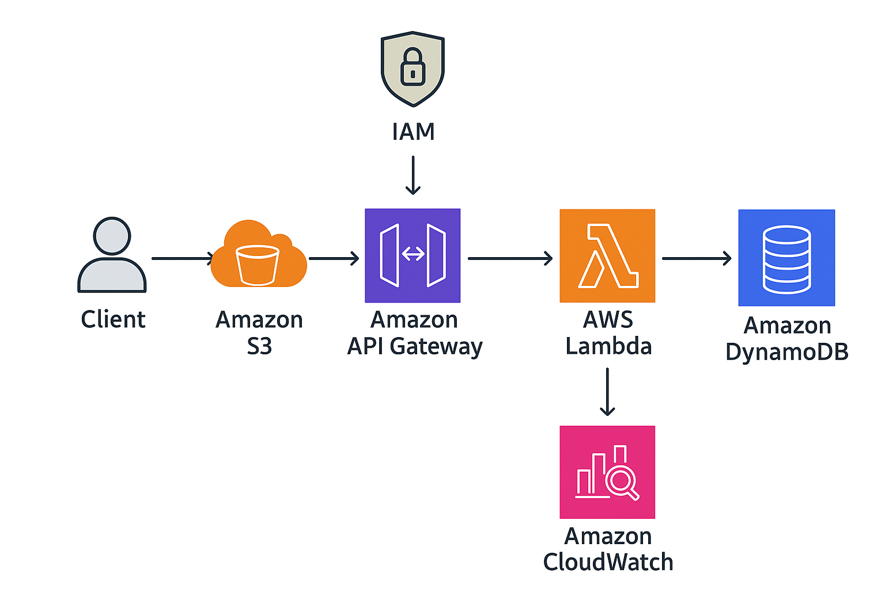

## 📌 Solution Overview

This project demonstrates the implementation of a **serverless REST API** on AWS to manage a simple to-do list (or customer records). The backend is fully serverless, relying on **Amazon API Gateway**, **AWS Lambda**, and **Amazon DynamoDB** for CRUD (Create, Read, Update, Delete) operations.

A static frontend hosted on **Amazon S3** (and optionally distributed via **Amazon CloudFront**) communicates with the backend via RESTful endpoints.

The solution is **cost-effective, scalable, and fully managed** — meaning developers do not have to manage servers or infrastructure.

### 🔹 Key Highlights:
- **Amazon API Gateway** provides REST endpoints for client interaction.  
- **AWS Lambda** functions handle CRUD logic and are triggered by API Gateway.  
- **Amazon DynamoDB** stores persistent records (NoSQL).  
- **AWS IAM** enforces secure access through roles and policies.  
- **Amazon CloudWatch** monitors logs, errors, and performance metrics.  
- **Amazon S3** hosts the static frontend.  

---

## 📌 Architecture Diagram

The following diagram illustrates the architecture of the solution:

### 🔹 Workflow:
1. The **user** interacts with the **frontend** hosted on Amazon S3.  
2. The frontend sends **HTTP requests** to **Amazon API Gateway**.  
3. API Gateway routes the request to the **Lambda function**.  
4. Lambda executes the appropriate CRUD logic and interacts with **DynamoDB** for data persistence.  
5. Logs and monitoring are collected in **Amazon CloudWatch**.  
6. **IAM roles and policies** control access between services securely.  
